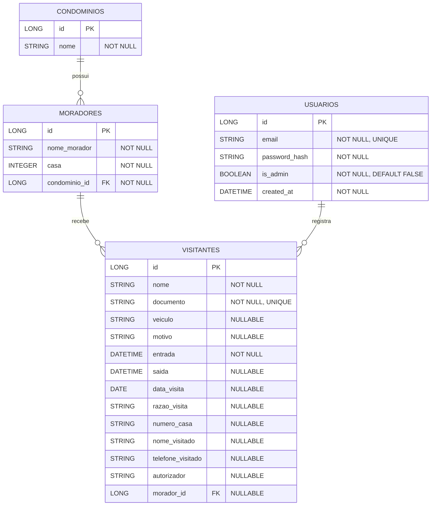
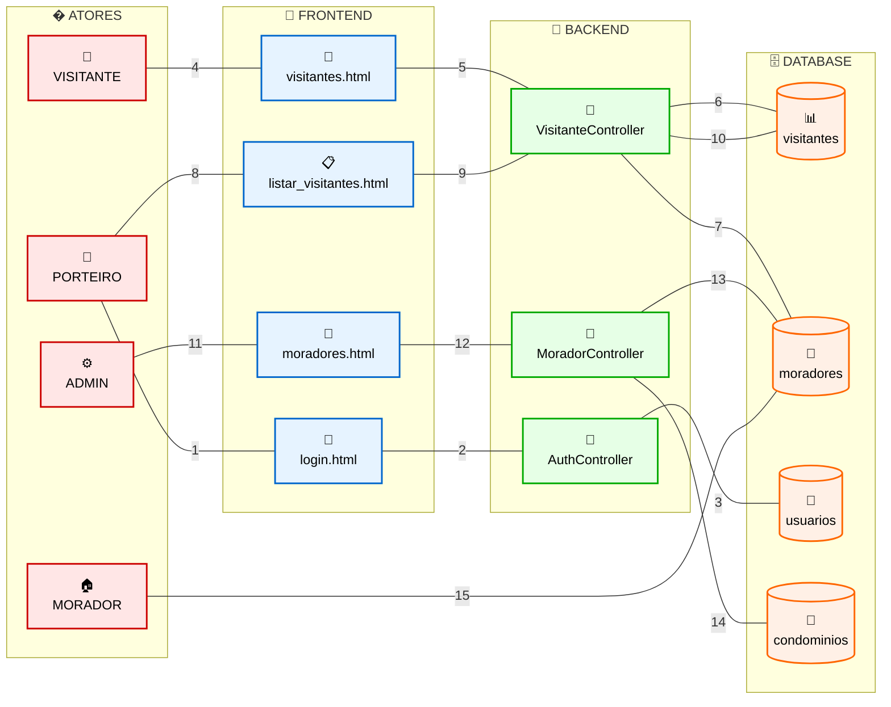
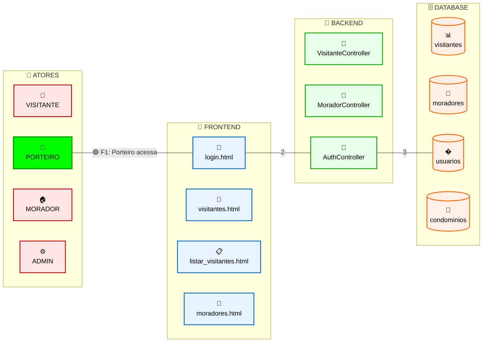
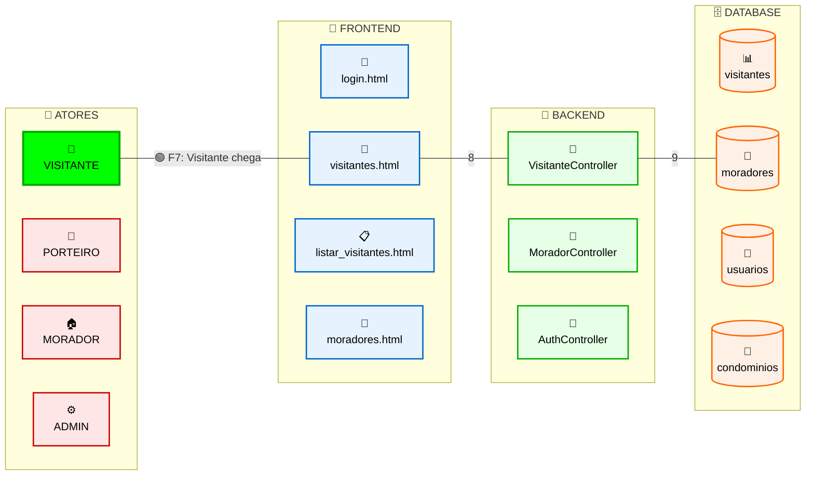
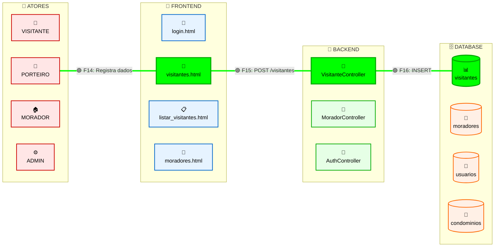
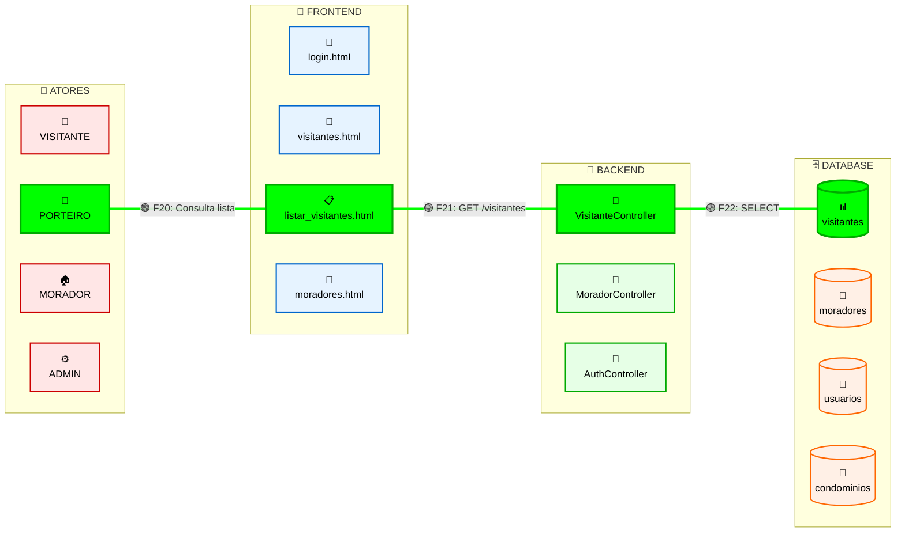

# registro_visitantes
Projeto Integrador II - Univesp - Turma 01 grupo 021 O presente projeto foi inicialmente desenvolvido para atender uma demanda de uma das comunidades visitadas. Neste caso um condomínio residencial. O sistema desenvolvido almeja possibilitar o registro de acesso de visitantes ao condomínio. O modelo original foi baseado no conceito entidade-relacionamento:  

## Diagrama Entidade-Relacionamento (DER)

### Relacionamentos:
- **CONDOMINIOS → MORADORES**: Um condomínio pode ter vários moradores (1:N)
- **MORADORES → VISITANTES**: Um morador pode receber vários visitantes (1:N)
- **USUARIOS → VISITANTES**: Um usuário (porteiro) pode registrar vários visitantes (1:N)

### Tabelas Principais:
- **condominios**: Armazena informações dos condomínios
- **moradores**: Armazena dados dos moradores por casa
- **visitantes**: Registra todas as visitas com entrada/saída
- **usuarios**: Sistema de autenticação para porteiros/administradores

## História do Usuário

## Animação GIF - Simulação Real do Fluxo A4

### 🎬 Frame por Frame (1 segundo cada):

**Frame 1-6: FLUXO DE LOGIN**

**Frame 7-13: CHEGADA DO VISITANTE**

**Frame 14-19: REGISTRO DA VISITA**

**Frame 20-25: CONSULTA DE VISITANTES**

### 🎯 **Sequência de Animação (25 frames total):**

1. **Frames 1-6**: Login do Sistema (verde percorre A2→F1→B3→D3)
2. **Frames 7-13**: Chegada do Visitante (verde percorre A1→A2→F2→B1→D2)
3. **Frames 14-19**: Registro da Visita (verde percorre A2→F2→B1→D1)
4. **Frames 20-25**: Consulta de Visitantes (verde percorre A2→F3→B1→D1)

### 📋 **Para criar o GIF:**
- Cada frame = 1 segundo
- Elemento ativo = cor verde (#00FF00)
- Conexões ativas = linha verde espessa
- Elementos inativos = cores normais
- Total: 25 segundos de animação

### User Stories Detalhadas:

#### 🚪 **Como Porteiro**
- **US001**: Como porteiro, quero fazer login no sistema para acessar as funcionalidades de registro
- **US002**: Como porteiro, quero registrar a entrada de visitantes para controlar o acesso ao condomínio
- **US003**: Como porteiro, quero registrar a saída de visitantes para manter o controle completo
- **US004**: Como porteiro, quero consultar a lista de visitantes para verificar quem está no condomínio
- **US005**: Como porteiro, quero buscar visitantes por nome/documento para localizar registros rapidamente

#### 🏠 **Como Morador**
- **US006**: Como morador, quero que meus visitantes sejam registrados adequadamente para garantir segurança
- **US007**: Como morador, quero que o sistema mantenha meus dados atualizados para facilitar o registro

#### 👤 **Como Administrador**
- **US008**: Como administrador, quero gerenciar usuários do sistema para controlar acessos
- **US009**: Como administrador, quero visualizar relatórios de visitação para análise de segurança
- **US010**: Como administrador, quero gerenciar dados dos moradores para manter informações atualizadas

### Fluxos Principais:

#### 📝 **Fluxo de Registro de Entrada**
1. Visitante chega à portaria
2. Porteiro solicita documento de identificação
3. Porteiro acessa formulário de registro (`visitantes.html`)
4. Sistema valida dados via `VisitanteController.java`
5. Dados são salvos no banco PostgreSQL
6. Visitante recebe autorização de entrada

#### 📋 **Fluxo de Consulta**
1. Porteiro acessa lista de visitantes (`listar_visitantes.html`)
2. Sistema carrega dados via `script_lista_visitantes.js`
3. API retorna registros do banco de dados
4. Interface exibe lista formatada

#### 🚶 **Fluxo de Registro de Saída**
1. Visitante solicita saída
2. Porteiro localiza registro ativo
3. Sistema atualiza horário de saída
4. Registro é finalizado no banco

Para a base de desenvolvimento foi utilizado o docker desktop, com Postgres, focando no desenvolvimento triplo (DB, Frontend, Backend).

